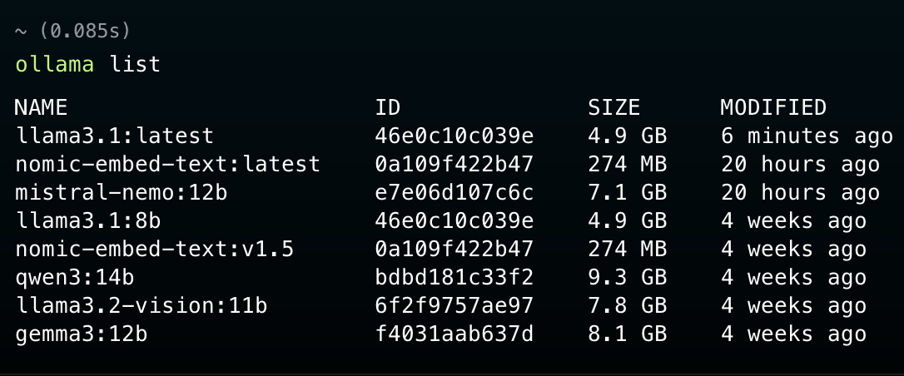
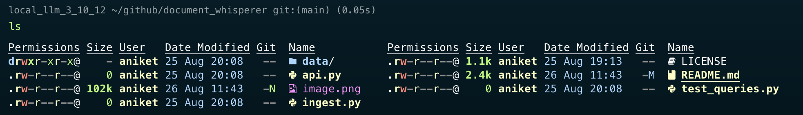

# document_whisperer

Repo for talking to documents

Models present:

Current Structure:

  

<pre>  
+----------------------+      +-------------------------+      +-----------------------+  
|    Research PDFs    |------>|  Ingestion Pipeline    |------>|      Datastores      |  
|  (Directory/Upload)  |      |  (Python CLI Script)    |      |                      |  
+----------------------+      |                        |      | [VectorDB: ChromaDB]  |  
                              | 1. Parse (PyMuPDF)      |      |  - Embeddings        |  
                              | 2. Extract Metadata    |      |  - Content Chunks    |  
                              | 3. Chunk (Heading-Aware)|      |  - Core Metadata      |  
                              | 4. Embed (Ollama)      |      |                      |  
                              | 5. Store (Chroma/DuckDB)|      | [SQL DB: DuckDB]      |  
                              +-------------------------+      |  - Doc Metadata      |  
                                                                |  - Chunk Analytics    |  
                                                                +-----------------------+  
                                                                            ^  
                                                                            |  
+----------------------+      +-------------------------+      +-----------+-----------+  
|    User/Client      |------>|      FastAPI Server    |<----->|    RAG Pipeline      |  
|  (OpenWebUI, cURL)  |      |                        |      |                      |  
+----------------------+      | POST /query            |      | 1. Embed Query        |  
  - Question          <-------| GET  /doc/:id          |      | 2. Retrieve (Chroma)  |  
  - Answer w/ citations        | POST /ingest            |      | 3. Rerank (Local)    |  
                              +-------------------------+      | 4. Context Assembly  |  
                                            |                    | 5. Prompt LLM (Ollama)|  
                                            v                    +-----------------------+  
                                +---------------------+  
                                |  Ollama Service    |  
                                |                    |  
                                | - LLM              |  
                                | - Embedding Model  |  
                                +---------------------+  
</pre>